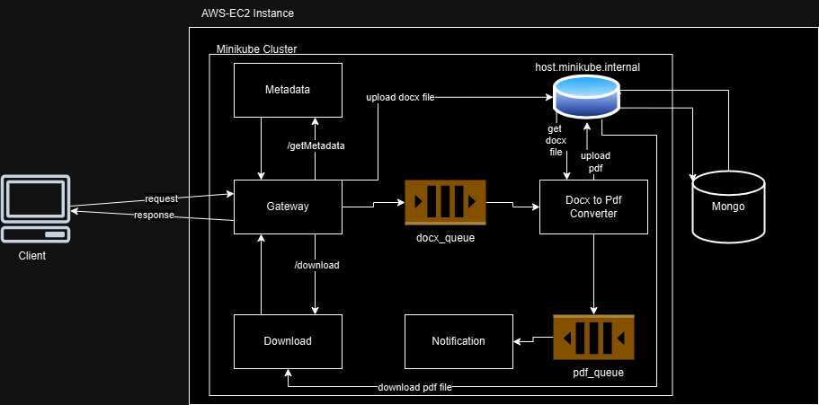

# Docx to PDF Converter

This project is a **Docx to PDF Converter** web application where users can:
- Upload a `.docx` file.
- Optionally encrypt the PDF with a password.
- View the file's metadata after upload.
- Download the converted PDF via a button or email.

The system is built using **microservice architecture** and provides a seamless experience with notification support. Users receive an email with a download button for the converted PDF.

---

## Features

- **Frontend:** Built with React.js and Tailwind CSS for an intuitive UI/UX.
- **Backend:** Uses Python, Flask, Docker, RabbitMQ, and MongoDB to handle the conversion, notifications, and metadata.
- **Microservices:**
  - **Gateway:** Routes requests to the appropriate services.
  - **Metadata Service:** Fetches metadata for the uploaded files.
  - **Download Service:** Handles PDF downloads.
  - **RabbitMQ Service:** Manages communication queues.
  - **Docx-to-PDF Converter Service:** Converts `.docx` files to `.pdf`.
  - **Notification Service:** Sends emails with PDF download links.
- **Architecture:** Uses Minikube and Docker for scalability and containerization.

---
## How to Use the Application

1. **Upload a Docx File:**
   - Go to [http://localhost:3000](http://localhost:3000).
   - Upload a `.docx` file.
   - Provide your email and an optional password to encrypt the PDF.
   - Submit the form.

2. **View File Metadata:**
   - Once the file is uploaded, the application will display its metadata (e.g., file size, upload date).

3. **Download the PDF:**
   - Click the "Download" button to download the PDF immediately.
   - Alternatively, check your email for a notification containing a download link.

---
## API Endpoints

### Frontend URL

- **URL:** [http://3.110.48.64:3000/](http://3.110.48.64:3000/)

### Backend URL

- **URL:** [http://13.235.95.204:8081/](http://13.235.95.204:8081/)

### Backend Endpoints

1. **Upload File**
   - **URL:** `http://13.235.95.204:8081/upload`
   - **Method:** `POST`
   - **Request (Form Data):**
     - `docx` (required)
     - `email`(optional to send file through email)
     - `password` (optional to encrypt and protect generated PDF)
   - **Response:**
     ```json
     {
       "docx_id": "6742147169a563840a36958e",
       "message": "file uploaded successfully"
     }
     ```

2. **Get File Metadata**
   - **URL:** `http://13.235.95.204:8081/getMetadata?fid=<docx_id>`
   - **Method:** `GET`
   - **Query Parameter:** 
     - `fid` (docx_id from upload response)
   - **Response:**
     ```json
     {
       "author": null,
       "created": null,
       "keywords": null,
       "modified": "Sat, 23 Nov 2024 17:28:44 GMT",
       "paragraph_count": 268,
       "subject": null,
       "title": "Word Document",
       "word_count": 775
     }
     ```

3. **Download PDF**
   - **URL:** `http://13.235.95.204:8081/download?fid=<docx_id>`
   - **Method:** `GET`
   - **Query Parameter:**
     - `fid` (docx_id from upload response)
   - **Response:** PDF file

---

## Prerequisites

Ensure the following are installed:
- **Docker**
- **Python**
- **Kubectl**
- **Minikube**
- **MongoDB**

---

## Setup Instructions

### Backend Setup

1. Clone the repository:
   ```bashy
   git clone <repository-url>
   cd Rapidfort-Assignment/word-to-pdf-converter-backend
   ```

2. Start Minikube:
   ```bashy
   minikube start
   minikube addon enable ingress
   ```

3. Add the following to your `/etc/hosts` file:
   ```plaintext
   127.0.0.1 docx2pdfconverter.com
   127.0.0.1 rabbitmq-manager.com
   ```

4. Run the backend setup scripts:
   - **Start all Kubernetes manifests**:
     ```bash
     ./start.sh
     ```
   - **Build and push Docker images**:
     ```bash
     ./buildandpush.sh
     ```

5. Open a new terminal and run:
   ```bash
   minikube tunnel
   ```

6. Set up RabbitMQ queues:
   - Open [RabbitMQ Manager](http://rabbitmq-manager.com) in your browser.
   - Login with:
     - **Username:** guest
     - **Password:** guest
   - Create two queues:
     - `docx`
     - `pdf`

The backend services should now be running. You can access them at:
- **Gateway:** [http://docx2pdfconverter.com](http://docx2pdfconverter.com)
- **RabbitMQ Dashboard:** [http://rabbitmq-manager.com](http://rabbitmq-manager.com)

---

### Frontend Setup

1. Navigate to the frontend directory:
   ```bash
   cd Rapidfort-Assignment/word-to-pdf-convert-frontend
   ```

2. Install dependencies:
   ```bash
   npm install
   ```

3. Start the frontend server:
   ```bash
   npm run start
   ```

Access the frontend at: [http://localhost:3000](http://localhost:3000)

<!-- ---

## API Endpoints

1. **Upload File**
   - **URL:** `/upload`
   - **Method:** `POST`
   - **Form Data:**
     - `email` (required)
     - `docx` (required)
     - `password` (optional)
   - **Response:** 
     - `success` (boolean)
     - `message` (string)
     - `docx_fid` (file ID for future requests)

2. **Get File Metadata**
   - **URL:** `/metadata?fid=<docx_fid>`
   - **Method:** `GET`
   - **Response:** Metadata for the uploaded file in JSON format.

3. **Download PDF**
   - **URL:** `/download?fid=<docx_fid>`
   - **Method:** `GET`
   - **Response:** Downloads the PDF file. -->

---

## Architecture Overview

This application is built using **microservices architecture** for better scalability and modularity.  
### Key Components:
1. **Gateway Service:** Routes requests to the correct microservices.
2. **Metadata Service:** Retrieves and sends file metadata to the user.
3. **Docx-to-PDF Converter Service:** Converts `.docx` files to `.pdf`.
4. **Download Service:** Handles the PDF file downloads.
5. **Notification Service:** Sends emails with download links.
6. **RabbitMQ Service:** Manages communication between services using two queues (`docx` and `pdf`).

---

## Diagram

Below is the architecture diagram showing the system workflow:


---

## Demo Video

[Watch the demo video here](https://youtu.be/krsQ7Hg5K7s)

---

## Technologies Used

- **Frontend:** React.js, Tailwind CSS
- **Backend:** Python, Flask, MongoDB, RabbitMQ
- **DevOps:** Docker, Minikube, Kubernetes

---

## Contribution Guidelines

Want to contribute? Follow these steps:
1. Fork the repository.
2. Create a feature branch:
   ```bash
   git checkout -b feature-name
   ```
3. Commit your changes:
   ```bash
   git commit -m "Describe your changes"
   ```
4. Push the branch:
   ```bash
   git push origin feature-name
   ```
5. Open a pull request and explain your changes.

---

Enjoy using the **Docx to PDF Converter**! 🚀
